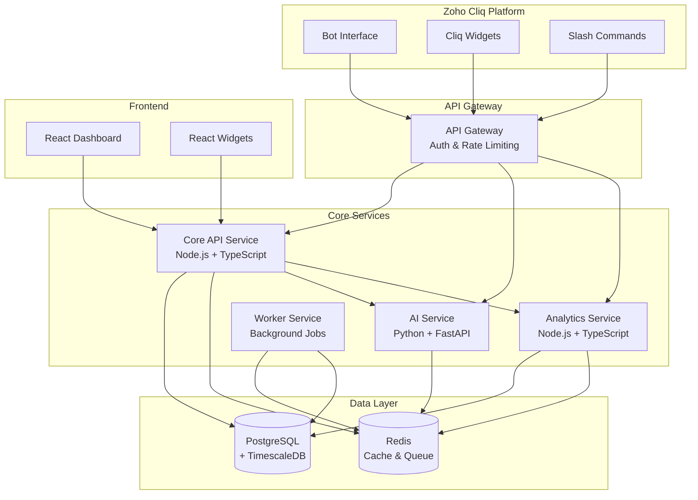
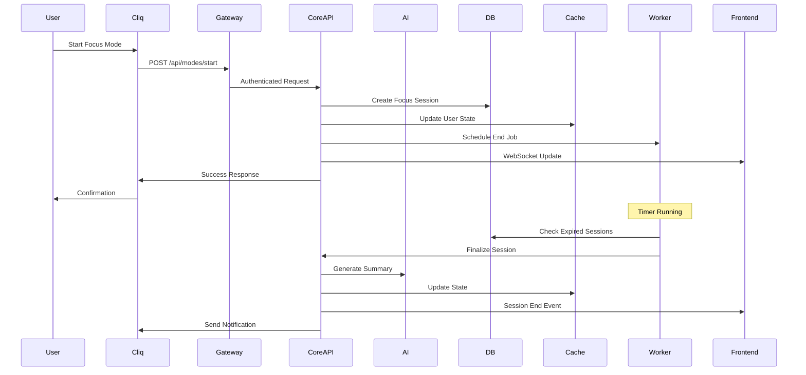
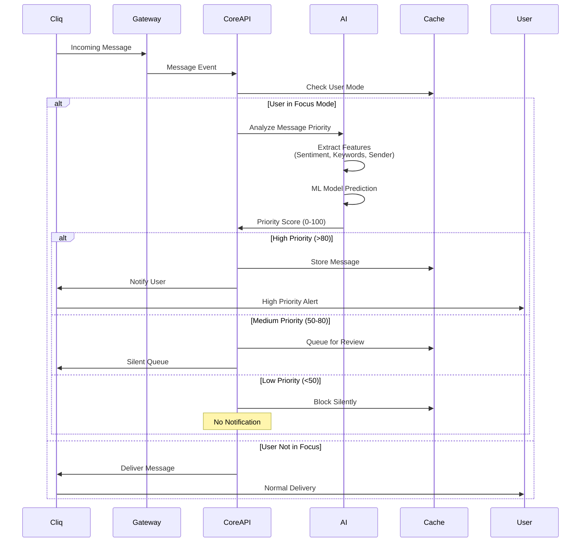
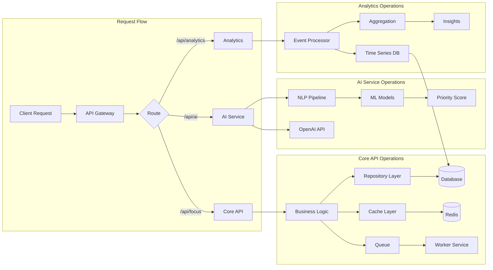
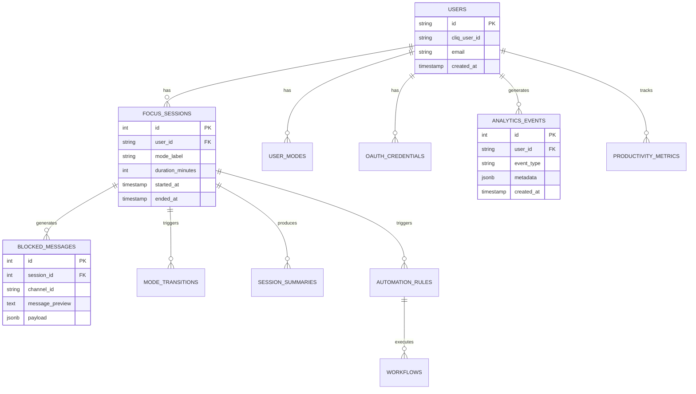
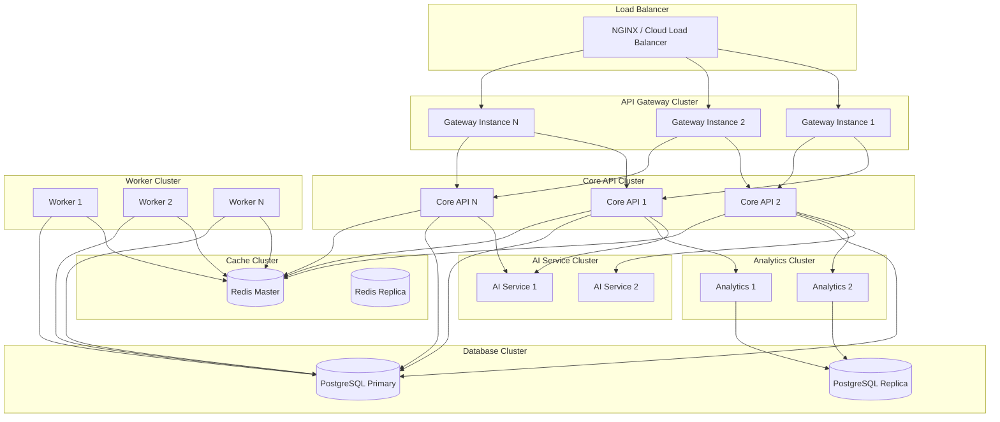

# FocusFlow Architecture Diagrams

## System Architecture Overview



---

## Data Flow: Focus Mode Activation



---

## Data Flow: Message Prioritization



---

## Service Communication



---

## Database Schema Overview



---

## Deployment Architecture



---

## Component Interaction Matrix

| Component | Interacts With | Communication Method |
|-----------|---------------|---------------------|
| API Gateway | Core API, AI Service, Analytics | HTTP/REST |
| Core API | Database, Redis, AI Service, Analytics | Direct DB, HTTP, Redis |
| AI Service | Core API, Redis, OpenAI | HTTP, Redis Pub/Sub |
| Analytics Service | Database, Redis, Core API | Direct DB, Redis, HTTP |
| Worker Service | Redis Queue, Database | BullMQ, Direct DB |
| Frontend | Core API | HTTP, WebSocket |
| Database | All Services | PostgreSQL Protocol |
| Redis | All Services | Redis Protocol |

---

## Technology Stack Visualization

```
┌─────────────────────────────────────────────────────────┐
│                    Frontend Layer                        │
│  React 18 + TypeScript + Tailwind CSS + Vite            │
└────────────────────┬────────────────────────────────────┘
                     │ HTTP/WebSocket
┌────────────────────▼────────────────────────────────────┐
│                   API Gateway Layer                      │
│         Express + TypeScript + Rate Limiting             │
└────┬───────────────┬───────────────┬────────────────────┘
     │               │               │
┌────▼────┐   ┌──────▼──────┐   ┌───▼──────────┐
│ Core API│   │ AI Service  │   │  Analytics   │
│ Node.js │   │  Python     │   │   Node.js    │
│ + TS    │   │  FastAPI    │   │   + TS       │
└────┬────┘   └──────┬──────┘   └───┬──────────┘
     │               │               │
     └───────┬───────┴───────┬───────┘
             │               │
     ┌───────▼───────┐  ┌────▼──────┐
     │  PostgreSQL   │  │   Redis   │
     │ + TimescaleDB │  │  Cache    │
     └───────────────┘  └───────────┘
```

---

## Request Lifecycle

```
1. User Action
   ↓
2. Zoho Cliq Webhook/API Call
   ↓
3. API Gateway
   ├─ Authentication
   ├─ Rate Limiting
   └─ Request Routing
   ↓
4. Core API Service
   ├─ Business Logic
   ├─ Validation
   └─ Service Orchestration
   ↓
5. Data Layer
   ├─ Database Query (PostgreSQL)
   ├─ Cache Check (Redis)
   └─ Queue Job (BullMQ)
   ↓
6. External Services (if needed)
   ├─ AI Service (Priority Analysis)
   ├─ Analytics Service (Event Tracking)
   └─ Zoho APIs (Cliq, Calendar)
   ↓
7. Response
   ├─ Update Cache
   ├─ Trigger WebSocket Event
   └─ Return to Client
```

---

## Caching Strategy

```
┌─────────────────────────────────────────┐
│           Cache Layers                   │
├─────────────────────────────────────────┤
│ L1: In-Memory Cache (Node.js)           │
│     - Session data                       │
│     - Frequently accessed objects         │
│     TTL: 5 minutes                       │
├─────────────────────────────────────────┤
│ L2: Redis Cache                         │
│     - User state                         │
│     - Focus session data                 │
│     - API response cache                 │
│     TTL: 1 hour                          │
├─────────────────────────────────────────┤
│ L3: Database Query Cache                │
│     - Query result cache                 │
│     - Materialized views                 │
│     TTL: 24 hours                        │
└─────────────────────────────────────────┘
```

---

## Security Architecture

```
┌─────────────────────────────────────────┐
│        Security Layers                  │
├─────────────────────────────────────────┤
│ 1. Network Security                     │
│    - HTTPS/TLS                          │
│    - VPN (if on-premise)                │
├─────────────────────────────────────────┤
│ 2. API Gateway Security                 │
│    - Rate Limiting                      │
│    - IP Whitelisting                    │
│    - Request Validation                 │
├─────────────────────────────────────────┤
│ 3. Authentication & Authorization       │
│    - OAuth 2.0 (Zoho)                   │
│    - JWT Tokens                         │
│    - Role-Based Access Control          │
├─────────────────────────────────────────┤
│ 4. Data Security                        │
│    - Encryption at Rest                 │
│    - Encryption in Transit              │
│    - Token Encryption (AES-256-GCM)     │
├─────────────────────────────────────────┤
│ 5. Application Security                 │
│    - Input Validation (Zod)             │
│    - SQL Injection Prevention (Prisma)    │
│    - XSS Protection (React)             │
└─────────────────────────────────────────┘
```

---

**Note**: These diagrams use Mermaid syntax and can be rendered in most modern markdown viewers including GitHub, GitLab, and many documentation tools.

